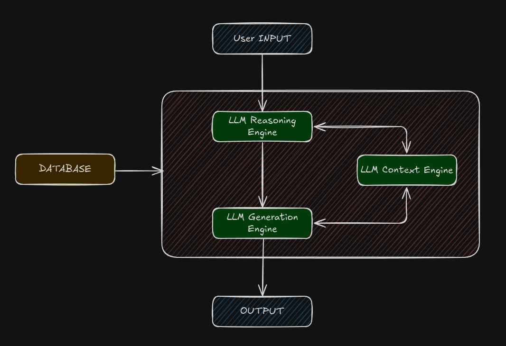

# Keepcoding AI Engineering course POC

> AI Assistant for Intelligent Task Definition (POC)

This is a Proof of Concept (POC) for an **AI-powered assistant** that helps knowledge workers define tasks captured in their inbox, following the **Getting Things Done (GTD)** methodology by David Allen.

Instead of manually thinking through each captured note, this assistant helps determine whether the input is an **ACTION** (single-step) or a **RESULT** (multi-step outcome), asking for clarifying context only when needed. Once clarified, it suggests well-defined next steps or rewrites the task for immediate execution.

## What This POC Includes

- [x] **Classification and reasoning model**: decides if the task is an ACTION or a RESULT.
- [ ] **Context engine**: asks the user questions to gather relevant metadata (when, where, dependencies...).
- [ ] **Action generator**: rewrites or suggests concrete next steps.
- [ ] **Data persistence layer**: stores input, classification, context, and final output.
- [x] **Interactive Codelab**: try the flow with a mock model.
- [x] **Architecture diagram**: explains the flow between components.

## Resources

### Presentation Video  

[Video](./presentacion_curso-ai-engineering_keepcoding.mkv)

### Slide Deck (Architecture & Flow)  

[View slides](https://view.genially.com/688347d156c297da43cffd05)

### Codelab Demo (Interactive)  

[codelab_ai-enineering-course-poc_keepcoding.ipynb](./codelab_ai-enineering-course-poc_keepcoding.ipynb)

### Video Walkthrough of the Codelab

[video-codelab_ai-enineering-course-poc_keepcoding](https://drive.google.com/file/d/1Tz2MA1xn1IBHIG3ID4BXVn5TIGBqULxN/view)

## Architecture Overview

The assistant architecture is composed of:

- **User Input** → Inbox item (e.g. “Buy screws for the shelf”)
- **LLM Reasoning Engine** → Classifies the task (ACTION or RESULT)
- **LLM Context Engine** → Gathers additional context via smart questions
- **LLM Generation Engine** → Outputs a clear task or first actions
- **Planner** → Suggests where the task should go (project/list/context)
- **Database** → Persists metadata and decisions

All components are modular and can be scaled independently.

## How to Use This POC

You can explore this prototype directly through the Codelab or clone the full code (coming soon).

## Status

This is an early-stage prototype, ideal for user testing and future integration into a personal productivity app.

## Credits

Designed and developed as part of a research-driven approach to task definition automation with AI and GTD principles.

## License

This project is licensed under the MIT License - see the [LICENSE](./LICENSE) file for details.
